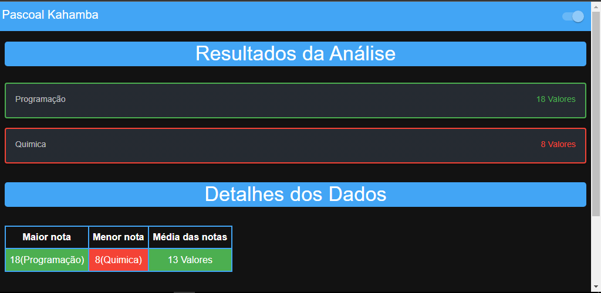
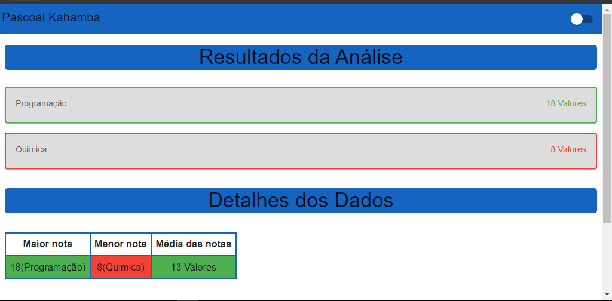

# Estatística de notas

Este `projeto` foi desenvolvido com `Javascript` para fim de melhorar ainda mas as minhas habilidades em `Javascript`. O projeto começa com o `Problema` e logo em baixo aparece o botão `Usar o programa` então vai abrir uma outra página que é a `solução`.

Assim que abre a `página` com um titulo `Estatística de notas` com dois campos o primeiro é `nome do aluno` que não é obrigátorio o segundo campo corresponte ao `número de disciplinas no aluno` que no mínimo têm que ser duas disciplinas, assim que colocas os dados corretos clica no botão `Iniciar análise` assim o programa começa a `registar` as respectivas disciplinas mudando o titulo de `Estatística de notas` para `Disciplina 1` o número de dsciplina vai depender do momento que estas a registar uma dada disciplina mas começa sempre com `Disciplina 1`. Também vai aparecer dois campos novos o primeiro `Nome da disciplina` e `nota da disciplina` de lembrar que ambos os campos são de carecter `obrigótorio`.

## Tecnologias

As seguintes ferramentas foram usadas na constuição deste projeto:

- HTML
- MATERIAL-UI
- TYPESCRIPT
- REACT

#

Feito por Pascoal Kahamba meu [Linkedin](https://https://www.linkedin.com/in/pascoal-kahamba-7b43bb233?lipi=urn%3Ali%3Apage%3Ad_flagship3_profile_view_base_contact_details%3BTg8LEKayToyytOX1pVAQ%2Bg%3D%3D)

[👉Clique aqui para rodar o projeto👈](https://student-statistics.vercel.app/)😎
